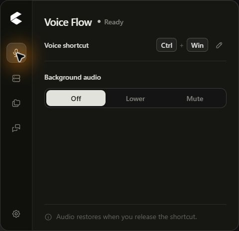
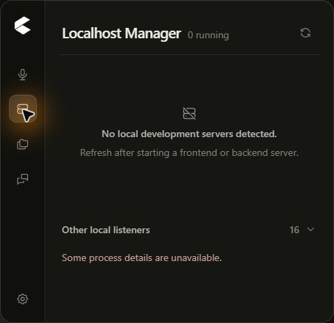
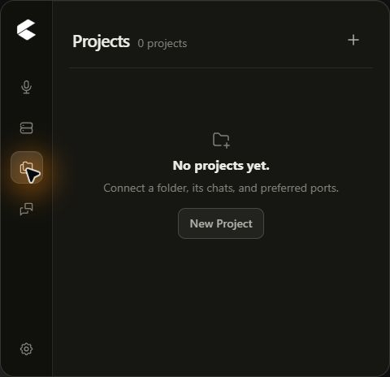
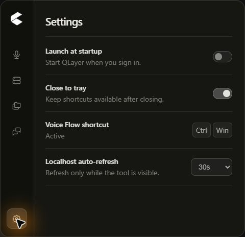

# QLayer

**A shortcut-first Windows companion for Codex and ChatGPT.**

Voice dictation, chat navigation, development server visibility, and project context in one compact, local-first utility.

[Download portable](https://github.com/Dist6/QLayer/releases/latest) | [Documentation](./docs/development.md) | [Report a bug](https://github.com/Dist6/QLayer/issues/new?template=bug_report.yml)

 

  

## What QLayer does

| Voice Flow                                                      | Localhost Manager                                                    | Projects                                                                           | Chat shortcuts                                                      |
| --------------------------------------------------------------- | -------------------------------------------------------------------- | ---------------------------------------------------------------------------------- | ------------------------------------------------------------------- |
| Hold one global shortcut to focus Codex or ChatGPT and dictate. | See local development servers, ports, processes, memory, and uptime. | Connect a local folder with its chats and detected or preferred development ports. | Save or discover Codex chats and choose where Voice Flow should go. |

QLayer stays in the Windows tray and keeps the workflow available without becoming another full-size application. It stores preferences locally and does not require an account, API key, or cloud service.

## Product tour

<table>
  <tr>
    <td width="33%" align="center">
       
      <strong>Localhost Manager</strong> Restrained, local-only server discovery.
    </td>
    <td width="33%" align="center">
       
      <strong>Projects</strong> Folders, chats, and preferred ports in one context.
    </td>
    <td width="33%" align="center">
       
      <strong>Settings</strong> Startup, visibility, shortcut, and refresh preferences.
    </td>
  </tr>
</table>

## Voice Flow

1. Open Codex or ChatGPT for Windows.
2. Hold the QLayer shortcut - **Ctrl+Win** by default.
3. Choose a saved chat or Project destination when needed.
4. Speak, then release the shortcut to finish dictation.

Background audio can remain unchanged, lower to a chosen level, or mute while speaking. QLayer restores the previous Windows audio state when the shortcut is released and fails safely when Codex or ChatGPT is not running.

## Localhost visibility without process control

Localhost Manager detects likely frontend and backend development servers and separates them from unknown local listeners. When available, it shows the URL, port, role, process, project identity, memory usage, and uptime.

Projects can add a detected development server as a preferred port for local status checks. QLayer can open a detected development URL in the default browser. It does **not** intercept traffic, expose a shell, or start, stop, restart, suspend, or terminate development processes.

## Install the portable release

1. Download [QLayer v0.1.0 for Windows x64](https://github.com/Dist6/QLayer/releases/download/v0.1.0/QLayer-v0.1.0-windows-x64-portable.zip).
2. Extract the archive to a stable folder.
3. Run **QLayer.exe**.

No installer or administrator access is required. The executable is currently unsigned, so Windows SmartScreen may display a warning on first launch. The checksum is published with every release.

## Requirements

- Windows 10 or Windows 11
- x64 processor
- Microsoft Edge WebView2 Runtime
- Codex or ChatGPT for Windows for Voice Flow and chat navigation

## Privacy by design

QLayer is local-first and has no telemetry, advertising, analytics, cloud sync, or remote logging. It does not record audio, read chat transcripts, access credentials or tokens, read Codex authentication files, read browser cookies, intercept traffic, or proxy requests.

Native capabilities are exposed through narrow Tauri commands with minimal permissions. See [Privacy](./docs/privacy.md), [Security](./SECURITY.md), and [Architecture](./docs/architecture.md).

## Technology

QLayer is built with [Tauri 2](https://tauri.app/), Rust, React, strict TypeScript, Vite, Tailwind CSS, native Windows APIs, and [Tabler Icons](https://tabler.io/icons).

<strong>Development</strong>

Install the Windows prerequisites for Tauri and use pnpm:

    pnpm install --frozen-lockfile
    pnpm typecheck
    pnpm lint
    pnpm test
    pnpm build
    cargo test --manifest-path src-tauri/Cargo.toml
    cargo check --manifest-path src-tauri/Cargo.toml

Run the desktop application:

    pnpm desktop

Build the portable archive:

    pnpm desktop:portable

## Documentation

| Document                               | Description                                      |
| -------------------------------------- | ------------------------------------------------ |
| [Architecture](./docs/architecture.md) | Feature boundaries and native integration design |
| [Development](./docs/development.md)   | Local development setup and commands             |
| [Testing](./docs/testing.md)           | Frontend, Rust, and release verification         |
| [Privacy](./docs/privacy.md)           | Local data and privacy boundaries                |
| [Roadmap](./docs/roadmap.md)           | Deliberately scoped future work                  |
| [Contributing](./CONTRIBUTING.md)      | Contribution rules and quality checks            |

## Current scope

QLayer v0.1.0 supports Windows 10/11 x64. macOS, Linux, automatic updates, and direct development process management are not currently supported. Codex and ChatGPT are third-party applications whose UI and deep-link behavior may change.

QLayer is unofficial and is not affiliated with, endorsed by, or sponsored by OpenAI.

## License

Licensed under the [GNU Affero General Public License v3.0](./LICENSE).
